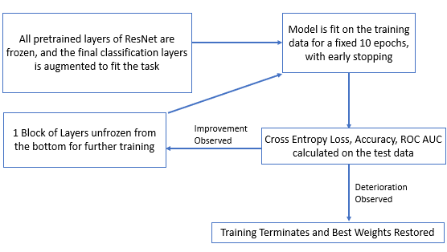
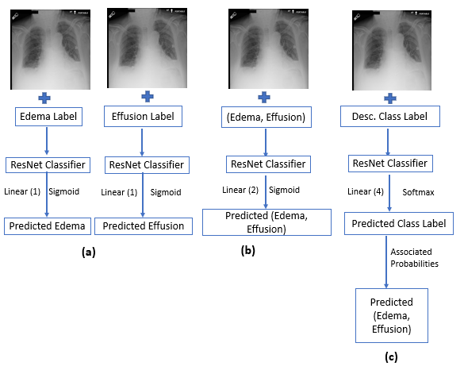
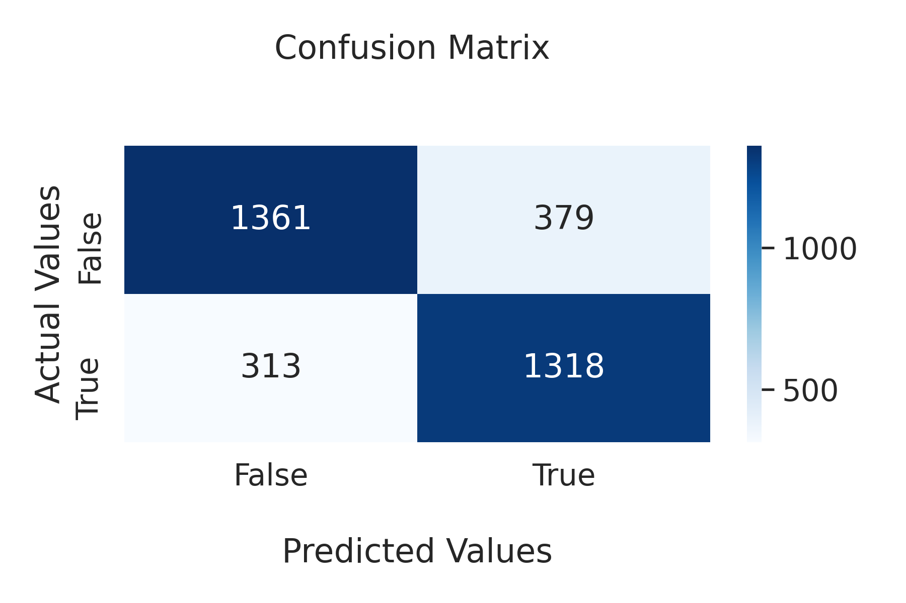
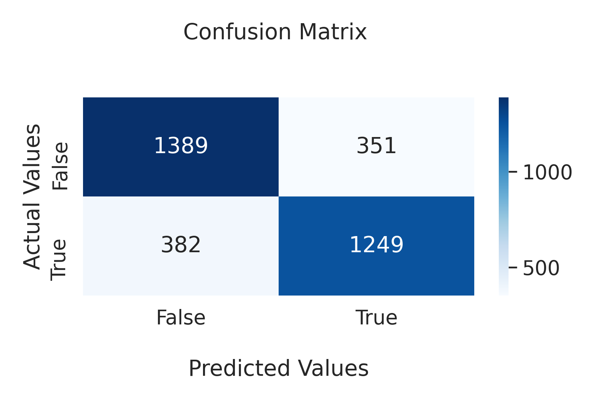
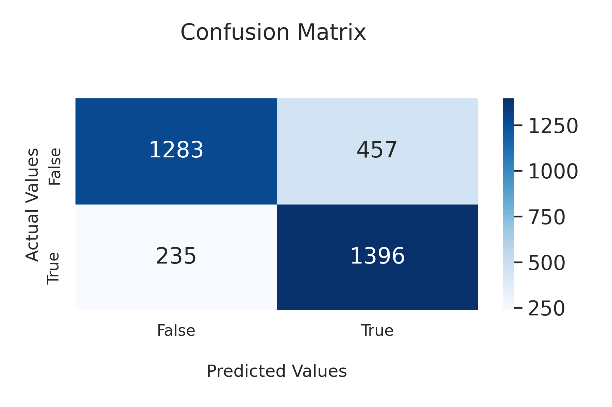

### Exploring the viability of Convolutional Neural Networks (CNNs) on a multi-label classification task to simultaneously detect Pulmonary Edema and Pleural Effusion

### BACKGROUND

#### Convolutional Neural Networks (CNN)
Convolutional Neural Networks (CNNs) are a powerful class of deep neural networks that have shown remarkable success in a variety of computer vision tasks, such as image classification, object detection, and segmentation. CNNs were inspired by the visual processing mechanism of the human brain and are designed to automatically learn hierarchical representations of visual features from raw data, such as images.

The key component of a CNN is the convolutional layer, which applies a set of learnable filters to the input image to extract local features. These filters slide over the entire image and perform a dot product operation with the local patch of pixels they are currently positioned over. By stacking multiple convolutional layers, the network can learn increasingly abstract and complex features, allowing it to capture high-level information such as object shapes, textures, and patterns.

In addition to the convolutional layers, CNNs also typically include pooling layers to reduce the spatial dimensions of the feature maps and improve the computational efficiency of the network, and fully connected layers to perform the final classification or regression task.

Training a CNN involves optimizing the network's parameters using a loss function and backpropagation algorithm, similar to other types of neural networks. However, due to their larger number of parameters and deeper architectures, CNNs require large amounts of labeled data and significant computational resources for training.

Overall, CNNs have revolutionized the field of computer vision and have achieved state-of-the-art performance on many benchmark datasets. They have also found applications in other domains such as natural language processing and speech recognition.

#### Transfer Learning
Transfer learning is a machine learning technique that involves using a pre-trained neural network to solve a new task. Instead of training a neural network from scratch, transfer learning involves taking an existing neural network that has already been trained on a large dataset and adapting it for a new task. The pre-trained neural network is typically a deep neural network that has learned to recognize complex features in images. To adapt the pre-trained network for a new task, the final layers of the network are typically replaced with new layers that are specific to the new task. These new layers are then trained on a smaller dataset that is specific to the new task. This approach allows for the transfer of knowledge from the pre-trained network, which has learned to recognize general features, to the new task, which may require more specialized features.

### OBJECTIVES

This project focuses on training a Convolutional Neural Network (CNN) for a supervised classification task, specifically for predicting the presence of pulmonary edema and pleural effusion in chest radiographs. The project is a series of experiments to formulate a pipeline based on deep learning best practices, to achieve the best performing model for this multi-label classification task. The first experiment involved determining the appropriate application of transfer learning to chest radiograph image data. The second experiment involved testing different formulations of the problem statement to achieve the best performing model. Separated binary label classifiers, a multi-label classifier and a multi-class classifier were all trained and evaluated using label prediction accuracy and the AUC (Area Under the Curve) of the ROC (Receiver Operating Characteristic) curve which is a measure of the model’s discriminability.

### METHODS

#### Experiment I

    

#### Experiment II

    

### RESULTS

    

    

    

    

    

### CONCLUSION

